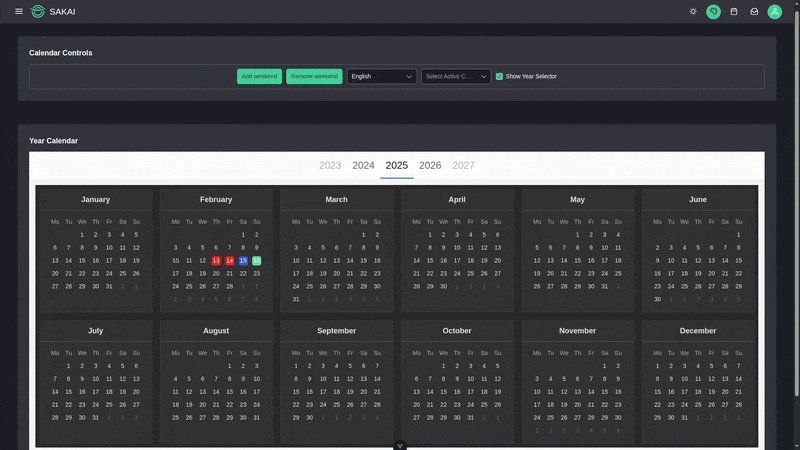

# vue3-year-calendar

A customizable year calendar component for Vue 3 applications, allowing users to display and interact with a full-year calendar. It supports date selection, multiple languages, dark mode, and custom styling for active dates.




## Features

- **Full-Year Display**: Shows all 12 months of a year in a grid layout.
- **Date Selection**: Toggle dates with custom styling for active dates.
- **Dark Mode**: Built-in support for dark mode with customizable styles.
- **Multilingual Support**: Supports multiple languages (English, Spanish, Portuguese, German, Traditional Chinese).
- **Year Selector**: Optional year selector to navigate between years.
- **Custom Styling**: Customize the appearance of active dates with predefined or custom classes.
- **Responsive Design**: Adapts to different screen sizes with media queries.
- **Hover Effects**: Hover effects on both individual days and entire month cards (with zoom effect).

## Installation

### Prerequisites
- **Vue 3**: This component is built for Vue 3 projects.
- **Day.js**: Used for date handling.
- **TypeScript**: The component is written in TypeScript for type safety.

### Install via npm
```bash
npm install vue3-year-calendar
```

Alternatively, you can install it locally by cloning the repository and linking it to your project:

```bash
git clone https://github.com/your-username/vue3-year-calendar.git
cd vue3-year-calendar
npm install
npm link
```

In your project directory:
```bash
npm link vue3-year-calendar
```

### Dependencies
Make sure to install the required dependencies:
```bash
npm install vue dayjs
```

## Usage

### Basic Setup
1. Import and register the `YearCalendar` component in your Vue 3 project.

```javascript
// main.ts
import { createApp } from 'vue';
import App from './App.vue';
import 'vue3-year-calendar/dist/vue3-year-calendar.css'; // Import styles

const app = createApp(App);
app.mount('#app');
```

2. Use the `YearCalendar` component in your Vue template.

```vue
<!-- YourComponent.vue -->
<template>
  <div>
    <YearCalendar
      v-model="year"
      v-model:active-dates="activeDates"
      @toggle-date="toggleDate"
      :lang="lang"
      :darkmode="darkmode"
      :show-year-selector="true"
      :active-class="activeClass"
      prefix-class="your_customized_wrapper_class"
    />
  </div>
</template>

<script setup lang="ts">
import { ref } from 'vue';
import { YearCalendar } from 'vue3-year-calendar';

interface ActiveDate {
  date: string;
  className?: string;
}

const year = ref(2023);
const lang = ref('en');
const darkmode = ref(false);
const activeClass = ref('red');
const activeDates = ref<ActiveDate[]>([
  { date: '2023-01-15', className: 'red' },
  { date: '2023-02-20', className: 'blue' },
]);

const toggleDate = (dateInfo: { date: string; selected: boolean; className?: string }) => {
  const newDates = [...activeDates.value];
  const dateIndex = newDates.findIndex((d) => d.date === dateInfo.date);

  if (dateInfo.selected && dateIndex === -1) {
    const newDate: ActiveDate = {
      date: dateInfo.date,
      className: dateInfo.className || activeClass.value || undefined,
    };
    newDates.push(newDate);
  } else if (!dateInfo.selected && dateIndex !== -1) {
    newDates.splice(dateIndex, 1);
  }

  activeDates.value = newDates;
};
</script>
```

### Props
| Prop              | Type               | Default                        | Description                                                                 |
|-------------------|--------------------|--------------------------------|-----------------------------------------------------------------------------|
| `value`           | `string | number` | Current year (e.g., `2023`)    | The year to display in the calendar.                                        |
| `activeDates`     | `Array`           | `[]`                           | List of active dates (format: `YYYY-MM-DD`). Can include custom classes.    |
| `lang`            | `string`          | `'en'`                        | Language for month and day names (`'en'`, `'es'`, `'pt'`, `'de'`, `'tw'`). |
| `activeClass`     | `string`          | `''`                           | Default class for active dates (`'red'`, `'blue'`, `'your_customized_classname'`, `'custom-day'`). |
| `prefixClass`     | `string`          | `'yc-calendar--active'`        | Prefix for active date classes.                                             |
| `showYearSelector`| `boolean`         | `true`                        | Show/hide the year selector at the top.                                     |
| `darkmode`        | `boolean`         | `false`                       | Enable dark mode for the calendar.                                          |

### Events
| Event         | Parameters                                              | Description                              |
|---------------|--------------------------------------------------------|------------------------------------------|
| `toggleDate`  | `{ date: string, selected: boolean, className?: string }` | Emitted when a date is toggled (selected/unselected). |
| `overDay`     | `{ date: string, selected: boolean, className?: string }` | Emitted when hovering over a day.        |

### Styling
The component comes with a default stylesheet (`dist/vue3-year-calendar.css`). You can customize the styles by overriding the following classes:

- `.yc-container`: Main container of the calendar.
- `.yc-month`: Container for each month.
- `.yc-calendar`: Calendar container for each month.
- `.yc-day`: Individual day elements.
- `.yc-dark`: Dark mode styles.

Example of custom styling:
```css
.yc-day.red {
  background-color: #ff0000;
  color: white;
}

.yc-dark .yc-container {
  background-color: #121212;
}
```

## Example with PrimeVue

You can integrate `vue3-year-calendar` with PrimeVue for a more polished UI. Below is an example of using the calendar in a PrimeVue-based component:

```vue
<template>
  <div class="flex flex-col p-4">
    <div class="card">
      <div class="font-semibold text-xl mb-4">Calendar Controls</div>
      <Toolbar>
        <template #start>
          <Button
            :icon="darkmode ? 'pi pi-sun' : 'pi pi-moon'"
            class="mr-2"
            severity="secondary"
            text
            @click="toggleDarkMode"
            :label="darkmode ? 'Light Mode' : 'Dark Mode'"
          />
        </template>
      </Toolbar>
    </div>

    <div class="card mt-8">
      <div class="font-semibold text-xl mb-4">Year Calendar</div>
      <YearCalendar
        v-model="year"
        v-model:active-dates="activeDates"
        @toggle-date="toggleDate"
        :lang="'en'"
        :darkmode="darkmode"
        :show-year-selector="true"
        :active-class="'red'"
        prefix-class="your_customized_wrapper_class"
      />
    </div>
  </div>
</template>

<script setup lang="ts">
import { ref, watch } from 'vue';
import { YearCalendar } from 'vue3-year-calendar';
import Button from 'primevue/button';
import Toolbar from 'primevue/toolbar';

interface ActiveDate {
  date: string;
  className?: string;
}

const year = ref(2023);
const darkmode = ref(false);
const activeDates = ref<ActiveDate[]>([
  { date: '2023-01-15', className: 'red' },
]);

const toggleDate = (dateInfo: { date: string; selected: boolean; className?: string }) => {
  const newDates = [...activeDates.value];
  const dateIndex = newDates.findIndex((d) => d.date === dateInfo.date);

  if (dateInfo.selected && dateIndex === -1) {
    newDates.push({ date: dateInfo.date, className: 'red' });
  } else if (!dateInfo.selected && dateIndex !== -1) {
    newDates.splice(dateIndex, 1);
  }

  activeDates.value = newDates;
};

const toggleDarkMode = () => {
  darkmode.value = !darkmode.value;
  const themeLink = document.getElementById('theme-css');
  if (themeLink) {
    themeLink.href = darkmode.value
      ? 'primevue/resources/themes/lara-dark-blue/theme.css'
      : 'primevue/resources/themes/lara-light-blue/theme.css';
  }
};
</script>
```

## Development

### Build the Component
To build the component for production:

```bash
npm run build
```

This will generate the compiled files in the `dist` directory.

### Run Locally
To test the component locally:

```bash
npm run dev
```

### Project Structure
- `src/components/YearCalendar.vue`: Main calendar component.
- `src/components/MonthCalendar.vue`: Subcomponent for rendering each month.
- `src/style.css`: Styles for the calendar.
- `dist/`: Output directory for the built component.

## Contributing

Contributions are welcome! Please follow these steps:

1. Fork the repository.
2. Create a new branch (`git checkout -b feature/your-feature`).
3. Make your changes and commit them (`git commit -m 'Add your feature'`).
4. Push to your branch (`git push origin feature/your-feature`).
5. Open a Pull Request.

## License

This project is licensed under the MIT License. See the [LICENSE](LICENSE) file for details.

## Acknowledgments

- Built with [Vue 3](https://vuejs.org/) and [Day.js](https://day.js.org/).
- Inspired by the need for a simple, customizable year calendar for Vue applications.
- This component is inspired by [vue-material-year-calendar](https://github.com/nono1526/vue-material-year-calendar) by nono1526.